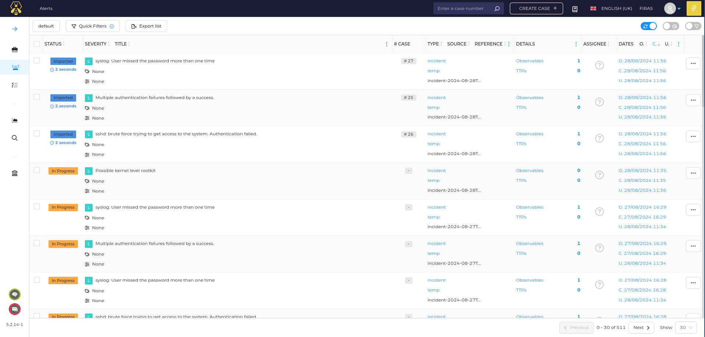
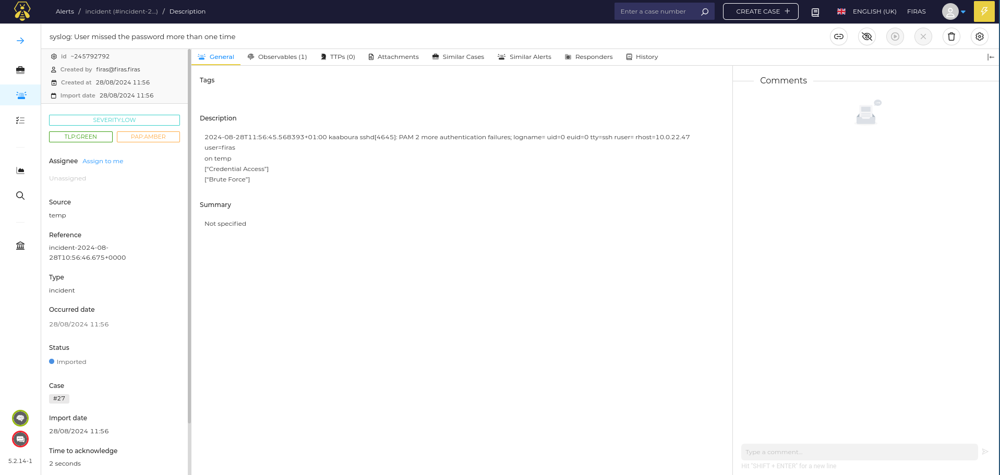

## Introduction

Since cyber attacks on servers have been increasing in the last years, we have to find a way to alert and mitigate these attacks, yes we have antivirus and firewall for that purpose but these these attacks have become more suffiticate and complex that these traditional tools have become obsolete and giving many false positives to be trusted on any infrastructure or have to be implemented on various clooud architecture and microservices

and that why in my last internship as SOC Analyst i was working on developing a more efficient and scalabe SIEM (Security information and event management) Solution to be integrated in the SmartSkills environment to automate treat detection and prevention and then be deployed on azure cloud

## What is SOC
A group of cybersecurity expert who's mission is to prevent , monitor , detect , analyze and responde to cyber attacks in order to insure that these threat and potential ones are properly mitigated , securing the organizations overall security 

### Key components 
SOC is based on 3 main pillar :

#### First pillar : People
All the various cybersecurity professionals who are involved in the SOC Team 

<h4><i> SOC Manager </i></h4>
The person who ensures that the team operates efficiently and meets organizational goals , and coordinates with other department 

<h4><i> SOC Analyst Level 1 (junior level) </i></h4>
The ability manually and automatic detect intrusions in the infrastructure , this includes malware infection ,file integrities and network breaches  (we will cover the tools and its configuration in this article ) , then escalate them to more senior analyst , they are also responsible for ticketing each incident and determine its severity
 
and would work on patching Medium risk level threats (Increased risk of malicious cyber activities, but nothing significant has occurred)
 
 
Main tasks :
<ol>
<li>Storing event logs and system alerts for suspicious activity</li>
<li>Prepare incident reports</li>
<li>Works on tickets and case alerts</li>
<li>Escalate incidents to tier 2 analysts</li>
</ol>

<h4><i> SOC Analyst Level 2 (incident r esponder)) </i></h4>
Track the source and mitigate the attacks on incidents that needs deeper investigation
 
and would work on patching Low risk level threats (No notable unusual activity)
 
 
Main tasks : 
<ol>
<li>Conduct deeper investigation on security incident </li>
<li>Work with other departments to improve overall security </li>
<li> Make detailed reports and documentation on the incident </li>
</ol>

<h4><i> SOC Analyst Level 3 (threat hunter)) </i></h4>
Making informative decisions about the attack impact to whether to change the architecture or not and investigating sophisticated threats that bypass traditional detection methods
 
and would work on patching High risk level (Significant risk of malicious cyber activities or the potential incident can cause severe damage in the customer environment.)
 
 
 
Main tasks :
<ol>
<li>Keep track of new emergent threats </li>
<li>Conduct pentest to identifie vulns in the system</li>
<li>Reverse engineering malware</li>
</ol>

#### second component : process
let's break down the monitor -> detect -> analyze -> respond  cycle 
<ol>
<li>Develop and implement a incident response workflow and continuously update it </li>
<li>Escalate incident based on severity level </li>
<li>Conduct post incident review to identify ares of improvement</li>
<li>Write documentation on action taken during incident response for audit</li>
<li>Stay updated on new emergent vuls</li>
<li>Train and educate SOC team on best incident response practices</li>

</ol>

####  final part : tecknologies
 
The effectiveness of SOC team depends on the tools used to help maintain the workflow 

one of the most used are : 

<b>Endpoint Detection and Response (EDR):</b>  
focuses on monitoring and responding to threats on host level 
tool example: CrowdStrike Falcon , Cybereason , Cynet ,...

<b>eXtended Detection and Response (XDR):</b>  
integrate EDR functionalities with capability of network detection and response , so it collects data (logs) from endpoints and networks, with the abilities to integrate AI and machine learning to automate SOC workflow cycle and eliminate the need of manual data correlation
tool example: Wazuh , Cortex XDR , CrowdStrike Falcon Insight XDR ,...

<b>Security Orchestration Automation Response (SOAR):</b> 
collects data (logs) from endpoints and networks and uses automated workflow (pipeline) with the integration of AI 
to predict and respond for similar threats before they occurs 
tool example: IBM QRadar SOAR , FortiSOAR , Splunk ,...

<b>Intrusion Detection and Prevention System (IDPS ):</b> 
identify malicious behavior based on logs from endpoints and networks components , and signaling real time alerts , and in (IPS) it take preconfigured action based on the threat description to minimize potential damage 
tool example: Suricata , Cisco Secure IPS , Splunk ,...

<b>Security information and event management (SIEM): </b>
<i>Now to the fun part : implementing a SIEM architecture to help to automate threat detection and prevention but first</i>

## What is SIEM Solution 
Its Security information and event management (okeeey??) 

### How it works 
1 : collecting logs and events from servers and network components , in the context of SIEM they are called clients 

2 : storing and indexing logs (analyzing the log and give it an attribute suck as description and risk level to easily query and visualize them and to optimize storage ofc)

3 : if its a high level attack and alert will be created and assigned to one or group of SOC Analyst (level 2) or an automated action will take place (pipeline approach will take place )

4 : in case of automated response , based on implemented rules , the ip will be blocked (in case of brute forcing unauthorized cred or subdirectory enum), detecting file integrities , detecting SQL injection , detecting the use of CVE vulnerabilities , detecting RCE ( remote code execution ) and reverse shells , we can even add our own script to take action based on the attack description

5 : in case of manual investigation by the SOC Analysis , there will be database of IOCs (indicator of compromise that are signs of cyberattack that already accrued ) to help to search for similar attacks suck as malicious ips and using third parties apis to verifie file hashs 

### implementation 
### Project Link 
https://github.com/khaledmraad/SIEM_Architecture

 
Every part of this is dockerized to be easily deployed on cloud provider and scalable with Kubernetes for production 
wazuh manager and Shuffle are in seprate env
#### Software component and configuration

each component of this architecture is open source

<ul>
<li><h4>PfSense : </h4></li>
Used as backbone of the network security
  
add interfaces on Pfsense : 

and make sure to install wazuh agent on it (more on that later)

<li><h4>Suricata : </h4></li>
Suricata is both an intrusion detection system (IDS), and intrusion prevention system (IPS), or be used for network security monitoring.
can be installed on PfSense from the PfSense web dashboard and change the monitor interface to the VirtualBox (we could monitor multiple Interface by having a physical network card and move the VLANs to it and configure it as suricata interface )
and enable the type of traffic you want to monitor
and ensure EVE JSON Log is enabled 
then edit the ossec.conf in the PfSense to send the logs into wazuh manager
and restart wazuh agent

<li><h4>WAZUH : </h4></li>
Open source platform for threat detection , system monitoring and incident response 
 
 
Wazuh Agent : sends logs to the wazuh agent , monitoring rules can be added in the ossec.conf Cynetfile (exp : file integrity , RCE , SQL injection ,brute force attacks ,  ... )  
rule can be found in the wazuh poc documentation : https://documentation.wazuh.com/current/proof-of-concept-guide/index.html
 
 

Wazuh Manager : collect logs from many wazuh agents and store them in elasticSearch database (already preconfigured) with log visualisation on its web interface dashboard  

<li> <h4> Shuffle</h4> </li>
Shuffle is a no-code automation platform (SOAR) that lets you automate your processes. We are focused on making automation accessible to everyone, using AI + a simple drag-and-drop interface (with code editing for advanced users).

in this pipeline we take the logs send by Wazuh manager api to send it to theHive (our SOC Analyst dashboard) and run our our cortex analysers and if its not a false positive we send a notification to discord bot or by email 

<li> <h4> TheHive</h4> </li>
TheHive is an open-source Security Incident Response Platform (SIRP) designed to assist Security Operations Centers (SOCs) in managing and investigating security incidents. It provides a comprehensive set of features that enable efficient case management, collaboration, and incident tracking.

here we can see that the ip making the brute force is not malicious but we can block it by a set of rules from the wazuh manager

here we can see that we can assign the alert to a SOC analyst to take action id needed
all the details of the attack are in the observable section

<li> <h4> Cortex : </h4> </li>
Cortex is an open-source security analysis and response engine designed to help Security Operations Centers (SOC) automate the analysis of observables (such as IP addresses, URLs, domain names, file hashes) and execute responsive actions. Cortex allows for extensive analysis using a variety of built-in analyzers and responders, making it a crucial tool for enhancing incident response capabilities.

here we choose to use 3 analysers from Cortex 
AbusePDB : determine of the IP is malicious 
MISP : a database of IOC (indicator of compromise) to help searching for similar attacks suck as malicious ips and using third parties apis to verifie file hashs
virusToatal : to verifie the file hash in case of file integrity attack

all the result of the analysers are sent to TheHive 

<li> <h4> MISP : </h4> </li>
MISP (Malware Information Sharing Platform) is an open-source threat intelligence platform designed to facilitate the sharing, storing, and correlating of Indicators of Compromise (IoCs) and threat intelligence information. MISP enhances the ability of organizations to detect, respond to, and prevent cyber threats by enabling the collaborative sharing of threat data.

<li> <h4> Discord : </h4> </li>

here we can see the alert notifications sent to the discord channel 

</ul>

### Project Link 
https://github.com/khaledmraad/SIEM_Architecture

## Conclusion
In this guide, we’ve successfully set up a comprehensive SOC lab environment tailored for training purposes. By integrating tools like TheHive, Cortex, and MISP, you now have a versatile platform to practice and refine your cybersecurity skills. This lab provides a realistic environment for simulating attacks, analyzing threats, and honing your incident response strategies. Whether you’re preparing for real-world scenarios or just beginning your journey in cybersecurity, this SOC lab serves as an invaluable resource for hands-on learning and skill development. With everything in place, you’re ready to dive into the world of cybersecurity training and become proficient in managing and mitigating security threats.

<h3> Reach me on <a href="https://www.linkedin.com/in/khaled-mrad/">LinkedIn</a></h3>

